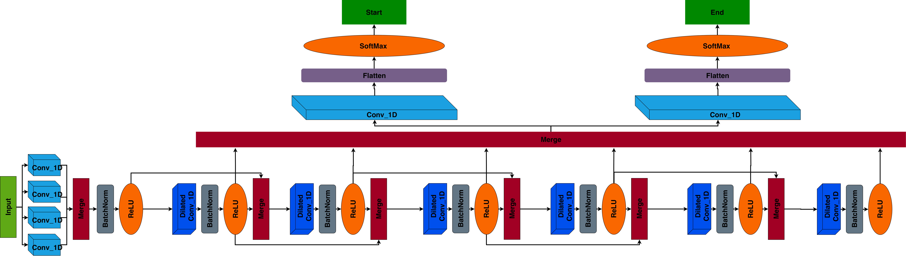

# Merchant Name Detection using Pytorch

**Authors**: Anzor Gozalishvili, Levan Tsinadze

## Short Summary
The idea was originally taken from one blog-post describing how they used some custom `CNN` and `character embedding` to do `named entity extraction`. We took that idea and some hints about model architecture and applied that for `merchant name extraction` from bank transaction records. We found that convolutional neural network works well to extract custom patterns in text using huge training dataset. That model outperformed other `RNN` type model architectures that worked on word level.

## Requirements

We recommend using python3 and a virtual env.
Or alternatively You can use Conda environment.

```
virtualenv -p python3 .env
source .env/bin/activate
pip install -r requirements.txt
```

## Task

Given a sample bank transaction string, predict the indices of merchant name inside a transaction.

```
given transaction: CASTLE ACADEMY LLC 303-663-7300 CO
get merchant indices: 0 14
predicted merchant: CASTLE ACADEMY
```

## Model Architecture Diagram
 You can see other diagram in `docs/` directory.

## Dataset
Dataset is recommended to provide in `csv` format. `dataset.csv` file should contain one column with text and another with label indices showing start and end of merchant name in given text (only one merchant can be detected!)
Dataset file should be placed in data/ directory

## Build Dataset
You can build dataset with running the following script:
```python build_dataset.py```

It will extract the texts and labels from the dataset, split it into
train/val/test and save it in a convenient format for training the model. It also does some data augmentation to make model more robust (without augmentation the model was predicting start index 0 with high confidence since data was mostly containing merchant name at the beginning)
(You can write your custom dataset builder)

## Model & Data Loader
You can explore more details on model architecture in `model/` directory which contains scripts:
 - data_loader.py -  it contains some helpful embedding scripts to convert text characters into image like format for applying convolutions
 - net.py - you can explore full model architecture here
 - net_helpers - just simple data iterator implementation for given model
 
## Training
You have to write your custom training script for given model depending on your needs (You can use given data loader scripts provided in model directory). 

## Evaluation
Here we leave evaluation script to give some hints for model evaluation. Please explore file `evaluate.py`

## References
https://github.com/cs230-stanford/cs230-code-examples/blob/master/pytorch/nlp/README.md

## Resources
- [PyTorch documentation](http://pytorch.org/docs/0.3.0/)
- [Tutorials](http://pytorch.org/tutorials/)
- [PyTorch warm-up](https://github.com/jcjohnson/pytorch-examples)
